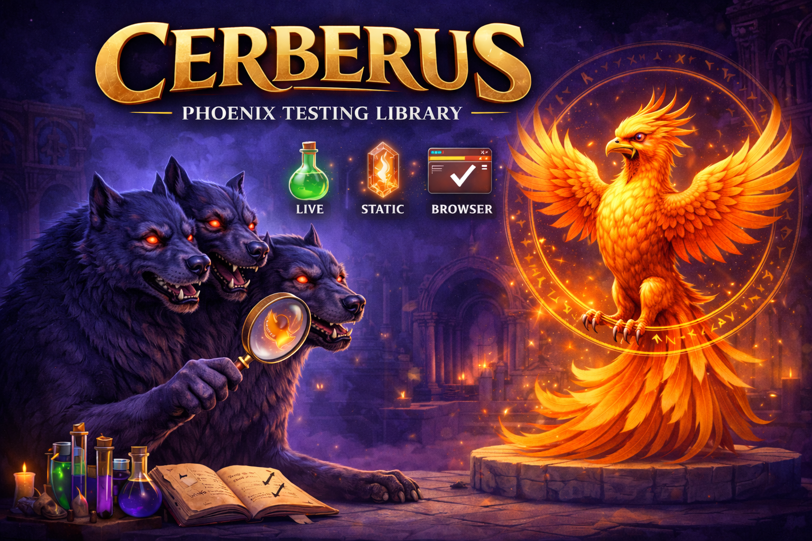

# Cerberus
[](https://hex.pm/packages/cerberus)
[](https://hexdocs.pm/cerberus/)
[](https://github.com/ftes/cerberus/blob/main/LICENSE)
[](https://github.com/ftes/cerberus/actions)


Cerberus is an experimental Phoenix testing library with one API across:
- non-browser Phoenix mode with static/live auto-detection and switching,
- browser mode for Chrome and Firefox via WebDriver BiDi.

Minimal API: You control your tests. Easily run single tests/describe blocks/entire modules in one or more browsers.

## Performance Highlight

Live (non-browser) assertions are optimized for large pages:
- `assert_has` / `refute_has` in live mode read from LiveViewTest's internal patched DOM tree,
- they avoid the previous `render(view)` -> HTML string -> LazyHTML re-parse loop on each assertion,
- matcher semantics stay in Cerberus so locators/matching remain consistent across drivers.

## 30-Second Start
```ex
# mix.exs
{:cerberus, "~> 0.1"}
```

```elixir
import Cerberus

session()
|> visit("/live/counter")
|> click(~l"button:Increment"r)
|> assert_has(~l"Count: 1")
```

> #### Tip
>
> Start with `session()` for most scenarios. Move to `session(:browser)` when validating real browser behavior, keyboard/mouse APIs, or browser-only assertions.
> Use `session(conn)` when you need to continue from an existing `Plug.Conn` state.
> Use `session(:chrome)` / `session(:firefox)` when you want an explicit browser target.

## Progressive Examples

### 1. Static Text Assertions

```elixir
session()
|> visit("/articles")
|> assert_has(~l"Articles")
|> refute_has(~l"500 Internal Server Error")
```

### 2. LiveView Interaction

```elixir
session()
|> visit("/live/counter")
|> click(~l"button:Increment"r)
|> assert_has(~l"Count: 1")
```

### 3. Form + Path Assertions

```elixir
session()
|> visit("/search")
|> fill_in("Search term", "Aragorn")
|> submit(~l"button:Run Search"r)
|> assert_path("/search/results", query: %{q: "Aragorn"})
|> assert_has(~l"Search query: Aragorn")
```

### 4. Scope + Navigation

```elixir
session()
|> visit("/scoped")
|> within(~l"#secondary-panel"c, fn scoped ->
  scoped
  |> assert_has(~l"Status: secondary")
  |> click(~l"link:Open"r)
end)
|> assert_path("/search")
```

`within/3` expects locator input (for example, `within(~l"#secondary-panel"c, fn s -> ... end)`).
In browser sessions, locator-based `within/3` can switch root into same-origin iframes.

Scoped text assertions also support plain-string shorthand:

```elixir
session()
|> visit("/scoped")
|> assert_has(~l"#secondary-panel"c, "Status: secondary")
|> refute_has(~l"#secondary-panel"c, "Status: primary")
```

Scoped assertion overloads use explicit scope and locator arguments:
- `assert_has(session, scope_locator, locator, opts \\ [])`
- `refute_has(session, scope_locator, locator, opts \\ [])`

Field-wrapper assertion pattern (Phoenix `core_components`-style wrappers):

```elixir
session()
|> visit("/field-wrapper-errors")
|> assert_has(closest(~l".fieldset"c, from: ~l"textbox:Email"r), ~l"can't be blank")
```

### 5. Multi-User + Multi-Tab

```elixir
primary =
  session()
  |> visit("/session/user/alice")

tab2 =
  primary
  |> open_tab()
  |> visit("/session/user")

user2 =
  session()
  |> visit("/session/user")
```

### 6. Browser-Only Extensions

```elixir
import Cerberus.Browser

session =
  session(:browser)
  |> visit("/browser/extensions")
  |> type("hello", selector: "#keyboard-input")
  |> press("Enter", selector: "#press-input")
  |> with_dialog(fn dialog_session ->
    click(dialog_session, ~l"button:Open Confirm Dialog"r)
  end)

session
|> assert_has(~l"Press result: submitted")
|> assert_has(~l"Dialog result: cancelled")

main =
  session(:browser)
  |> visit("/browser/popup/click")
  |> with_popup(
    fn source ->
      click(source, ~l"button:Open Popup"r)
    end,
    fn source, popup ->
      assert_path(source, "/browser/popup/click")
      assert_path(popup, "/browser/popup/destination", query: %{source: "click-trigger"})
    end
  )
```

> #### Warning
>
> `Cerberus.Browser.*` helpers are intentionally browser-only. Calling them on non-browser sessions raises explicit unsupported-operation assertions.
> Cross-origin iframe DOM access is still blocked by browser same-origin policy; use provider-level or parent-page assertions for those flows.

## Locator Quick Look

- Helper constructors:
  - `text("...")`, `link("...")`, `button("...")`, `label("...")`, `testid("...")`, `css("...")`, `role(:button, name: "...")`
- Locator composition:
  - `has:` filters matched elements by requiring a descendant locator (`label(...)`, `css(...)`, `text(...)`, `button(...)`, etc.)
  - `closest(base_locator, from: nested_locator)` resolves the nearest matching ancestor scope (for example nearest field wrapper for a label)
  - Example: `click(button("Apply", has: testid("apply-secondary-marker")))`
- Sigil:
  - `~l"Save"` text
  - `~l"Save"e` exact text
  - `~l"Save"i` inexact text
  - `~l"button:Save"r` role form (`ROLE:NAME`)
  - `~l"button[type='submit']"c` css form
  - `~l"save-button"t` testid form (defaults to exact matching)
  - rules:
    - at most one kind modifier (`r`, `c`, or `t`)
    - `e` and `i` are mutually exclusive
    - `r` requires `ROLE:NAME`

Role helpers currently support practical aliases used by actions/assertions:
- click/assert roles: `button`, `menuitem`, `tab`, `link`, `heading`, `img`
- form-control roles: `textbox`, `searchbox`, `combobox`, `listbox`, `spinbutton`, `checkbox`, `radio`, `switch`

## Switching Modes

Most tests switch modes by changing only the first session line:

```diff
-session()
-session()
+session(:browser)
 |> visit("/live/counter")
 |> click(~l"button:Increment"r)
|> assert_has(~l"Count: 1")
```

## Per-Test Browser Overrides

You can override browser defaults in one test by passing session opts:

```elixir
session(:browser,
  ready_timeout_ms: 2_500,
  user_agent: "Cerberus Mobile Spec",
  browser: [viewport: {390, 844}]
)
|> visit("/live/counter")
```

Isolation strategy:
- runtime process + BiDi transport stay shared,
- each `session(:browser, ...)` creates an isolated browser user context,
- context-level overrides (viewport/user-agent/popup mode/init scripts) are isolated per session and do not require a dedicated browser process.

SQL sandbox helper:

```elixir
owner_pid = Ecto.Adapters.SQL.Sandbox.start_owner!(MyApp.Repo, shared: false)
metadata = Cerberus.sql_sandbox_user_agent(MyApp.Repo, owner_pid)

session(:browser, user_agent: metadata)
```

Popup behavior:
- Preferred: use `Browser.with_popup/4` for deterministic popup capture and two-session assertions.
- `popup_mode: :allow` keeps browser default popup/new-window behavior (default).
- `popup_mode: :same_tab` injects an early preload script that rewrites `window.open(...)` to same-tab navigation.
- Firefox limitation: `popup_mode: :same_tab` is currently unsupported and raises explicitly.
- Known bug: Firefox BiDi preload registration may emit `chrome://remote/content/shared/Realm.sys.mjs` TypeError logs.
- `:same_tab` is a pragmatic fallback for autonomous flows that you cannot reliably trigger from test callbacks.

Same-tab workaround (OAuth-style redirect/result flow):

```elixir
session(:browser, browser: [popup_mode: :same_tab])
|> visit("/browser/popup/auto")
|> assert_path("/browser/popup/destination", query: %{source: "auto-load"}, timeout: 1_500)
|> assert_has(~l"popup source: auto-load"e)
```

When workaround is brittle:
- popup behavior depends on browser security/user gesture requirements,
- popup source script changes frequently or is third-party hosted,
- flow needs asserting both opener and popup side effects.

In those cases, prefer `Browser.with_popup/4` and assert both `main` and `popup` sessions directly.

## Browser Defaults and Runtime Options

You can configure defaults once:

```elixir
config :cerberus, :assert_timeout_ms, 300

config :cerberus, :browser,
  ready_timeout_ms: 2_200,
  ready_quiet_ms: 40,
  bidi_command_timeout_ms: 5_000,
  runtime_http_timeout_ms: 9_000,
  dialog_timeout_ms: 1_500,
  screenshot_full_page: false,
  screenshot_artifact_dir: "tmp/cerberus-artifacts/screenshots",
  show_browser: false
```

Override precedence is:
- call opts (`assert_has(..., timeout: ...)`)
- session opts (`session(assert_timeout_ms: ...)`, `session(:browser, ready_timeout_ms: ...)`, `session(:browser, ready_quiet_ms: ...)`, context overrides in `session(:browser, browser: [...])`)
- app config
- hardcoded fallback

Assertion-timeout fallback:
- Live and Browser assertions (`assert_*`/`refute_*`, including `assert_path`/`refute_path`) default to `500ms`.
- Static assertions remain immediate unless you pass explicit call/session/app timeout overrides.

Option scopes:
- Per-session context options: `ready_timeout_ms`, `ready_quiet_ms`, `user_agent`, `browser: [viewport: ..., user_agent: ..., popup_mode: :allow | :same_tab, init_script: ... | init_scripts: [...]]`.
- Global runtime launch options: `browser_name`, `webdriver_url`, `chrome_webdriver_url`, `firefox_webdriver_url`, `show_browser`, `headless`, `chrome_args`, `firefox_args`, `chrome_binary`, `firefox_binary`, `chromedriver_binary`, `geckodriver_binary` (`webdriver_urls` is still accepted for compatibility).
- Global browser defaults: `bidi_command_timeout_ms`, `runtime_http_timeout_ms`, `dialog_timeout_ms`, `screenshot_full_page`, `screenshot_artifact_dir`, `screenshot_path`.

`show_browser: true` runs headed by default. `headless` has higher precedence if both are set.

Because browser runtime + BiDi transport are shared per browser lane, runtime launch options should be treated as invocation-level config (not per-test toggles).

## Learn More

- [Getting Started Guide](docs/getting-started.md)
- [Cheat Sheet](docs/cheatsheet.md)
- [Architecture and Driver Model](docs/architecture.md)
- [Browser Support Policy](docs/browser-support-policy.md)

## Browser Runtime Setup

Cerberus browser tests use WebDriver BiDi.
Chrome and Firefox are supported browser targets.

Local managed runtime (default) uses configured browser and WebDriver binaries:

```elixir
config :cerberus, :browser,
  chrome_binary: "/path/to/chrome-or-chromium",
  chromedriver_binary: "/path/to/chromedriver",
  firefox_binary: "/path/to/firefox",
  geckodriver_binary: "/path/to/geckodriver"
```

Only the selected browser lane needs to be configured for a given run.

Headed mode:

```elixir
config :cerberus, :browser, show_browser: true
```

Remote runtime mode:

```elixir
config :cerberus, :browser,
  webdriver_url: "http://127.0.0.1:4444"
```

With `webdriver_url` set, Cerberus does not launch local browser/WebDriver processes.

For explicit multi-browser remote lanes in one invocation:

```elixir
config :cerberus, :browser,
  chrome_webdriver_url: "http://127.0.0.1:4444",
  firefox_webdriver_url: "http://127.0.0.1:5555"
```

Remote `webdriver_url` integration smoke test (Docker required):

```bash
CERBERUS_REMOTE_WEBDRIVER=1 mix test test/cerberus/remote_webdriver_behavior_test.exs
```

This test starts a `selenium/standalone-chromium` container with `docker run`,
connects Cerberus through `webdriver_url`, and force-removes the container on exit.

Global remote-browser invocation (Docker required):

```bash
mix test.websocket
mix test.websocket --browsers chrome,firefox
mix test.websocket test/cerberus/explicit_browser_test.exs
```

`mix test.websocket` starts/stops Selenium container(s) and runs one `mix test`
invocation with remote browser lane wiring. Use `--browsers` (`chrome`,
`firefox`, or `all`) to control lane provisioning; default is `all`.

Cross-browser conformance run:

```bash
mix test --only browser test/cerberus --exclude explicit_browser
```

`@tag :browser` uses the default browser lane. For explicit browser selection, use top-level tags (`@tag :chrome`, `@tag :firefox`) and disable a lane at test scope with `@tag chrome: false` or `@tag firefox: false`.

Explicit browser-lane override coverage:

```bash
mix test --only explicit_browser
```

Install local browser runtimes with public Mix tasks:

```bash
mix cerberus.install.chrome --version 146.0.7680.31
mix cerberus.install.firefox --firefox-version 148.0 --geckodriver-version 0.36.0
```

Both tasks install missing binaries and reuse existing per-version installations.
Version precedence is flags first, then matching env vars (`CERBERUS_CHROME_VERSION`, `CERBERUS_FIREFOX_VERSION`, `CERBERUS_GECKODRIVER_VERSION`), then defaults (latest stable Chrome/Firefox and GeckoDriver 0.36.0).

Stable output contracts:
- `--format json` for machine-readable payloads (paths, versions, env handoff keys)
- `--format env` for `KEY=VALUE` lines (for CI env files)
- `--format shell` for `export KEY='VALUE'` lines

Recommended runtime handoff:

```bash
eval "$(mix cerberus.install.chrome --format shell)"
eval "$(mix cerberus.install.firefox --format shell)"
```

```elixir
config :cerberus, :browser,
  chrome_binary: System.fetch_env!("CHROME"),
  chromedriver_binary: System.fetch_env!("CHROMEDRIVER"),
  firefox_binary: System.fetch_env!("FIREFOX"),
  geckodriver_binary: System.fetch_env!("GECKODRIVER")
```

CI-friendly form:

```bash
mix cerberus.install.chrome --format env >> "$GITHUB_ENV"
mix cerberus.install.firefox --format env >> "$GITHUB_ENV"
```

Installed paths are stable per version, for example:
- `tmp/chrome-<version>`
- `tmp/chromedriver-<version>`
- `tmp/firefox-<version>`
- `tmp/geckodriver-<version>`

## Migration Task

Cerberus includes an Igniter migration task for PhoenixTest codebases:

```bash
mix cerberus.migrate_phoenix_test
mix cerberus.migrate_phoenix_test --write test/my_app_web/features
```

It performs safe rewrites, reports manual follow-ups, and defaults to dry-run diff output.

Migration verification docs are maintainer-focused and kept in the repository under `docs/migration-verification*.md`.
