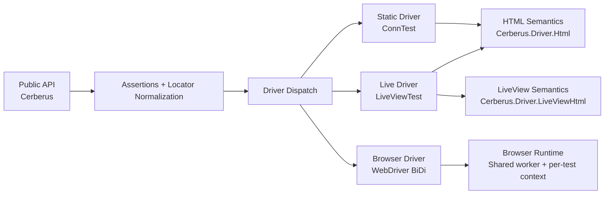

# Architecture and Driver Model

Cerberus is built around one session-first API and two user-facing modes (`:phoenix`, `:browser`).
Internally, Phoenix mode dispatches between static and live execution backends.

## Layering

## Why this shape?

- `Cerberus` API stays consistent across drivers.
- Shared semantics reduce drift in assertions and locator behavior.
- Browser mode serves as an oracle for HTML/DOM behavior when needed.

## Semantic Boundaries

- `Cerberus.Driver.Html`: platform behavior (labels, form ownership, control defaults, text extraction).
- `Cerberus.Driver.LiveViewHtml`: framework behavior (`phx-click`, `phx-change`, `phx-submit`, `phx-trigger-action`).

> #### Info
>
> This split keeps HTML rules testable without Phoenix internals and isolates LiveView-specific quirks to one layer.

## Multi-User / Multi-Tab Semantics

- `open_user/1` creates isolated user state in all drivers.
- `open_tab/1` creates another tab in the same user state in all drivers.
- Browser maps this to separate browsing contexts inside one user context.
- Static/live map this to separate `Plug.Conn` sessions with shared cookie semantics for tabs.

## Escape Hatches

- `unwrap/2`: direct access to underlying driver primitives when needed.
- `Cerberus.Browser.*`: browser-only low-level APIs for keyboard, drag, dialogs, JS evaluation, and cookies.

> #### Warning
>
> Keep escape hatches localized. Prefer shared Cerberus operations in conformance scenarios so switching between browser and non-browser modes stays cheap.
