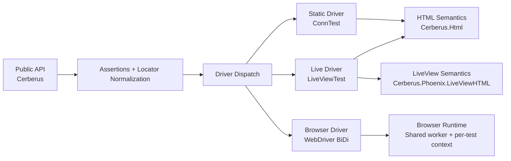

# Architecture and Driver Model

Cerberus is built around one session-first API and two user-facing modes (`:phoenix`, `:browser`).
Internally, Phoenix mode dispatches between static and live execution backends.

## Layering



## Why this shape?

- `Cerberus` API stays consistent across drivers.
- Shared semantics reduce drift in assertions and locator behavior.
- Browser mode serves as an oracle for HTML/DOM behavior when needed.

## Semantic Boundaries

- HTML semantics layer: platform behavior (labels, form ownership, control defaults, text extraction).
- LiveView semantics layer: framework behavior (`phx-click`, `phx-change`, `phx-submit`, `phx-trigger-action`).

> #### Info
>
> This split keeps HTML rules testable without Phoenix internals and isolates LiveView-specific quirks to one layer.

## Driver Module Map

Driver-first organization is the primary code layout rule:

- Static driver core: `lib/cerberus/driver/static.ex` and `lib/cerberus/driver/static/form_data.ex`.
- Live driver core: `lib/cerberus/driver/live.ex` and `lib/cerberus/driver/live/form_data.ex`.
- Browser driver core:
  - `lib/cerberus/driver/browser.ex` for orchestration.
  - `lib/cerberus/driver/browser/config.ex` for browser option normalization.
  - `lib/cerberus/driver/browser/expressions.ex` for browser-side JS expression builders.
  - `lib/cerberus/driver/browser/runtime.ex`, `lib/cerberus/driver/browser/bidi.ex`, and browser socket/context supervisors for BiDi lifecycle.

Cross-driver concern modules remain separate:

- `lib/cerberus/html/html.ex` for HTML-spec behavior.
- `lib/cerberus/phoenix/*` for Phoenix/LiveView-specific behavior.

## Multi-User / Multi-Tab Semantics

- `open_tab/1` creates another tab in the same user state in all drivers.
- Start a new isolated user by creating a new session (`session()` or `session(:browser)`).
- Browser maps this to separate browsing contexts inside one user context.
- Static/live map tabs to separate `Plug.Conn` sessions with shared cookie semantics.

## Browser Overrides and Isolation

- Browser runtime process and BiDi socket are shared for efficiency.
- Each browser session (`session(:browser, ...)`) creates a dedicated browser user context.
- Per-session browser overrides (`browser: [viewport: ..., user_agent: ..., init_script: ...]`) apply only to that session's user context.
- Result: test/module overrides do not require dedicated browser processes unless you need different runtime-level launch settings.

## Test Organization (Maintainer)

Integration contract tests are located under `test/cerberus` and use `Cerberus.*` module names.
Driver internals stay in driver-focused test paths such as `test/cerberus/driver/browser`.

Cross-driver integration tests use plain ExUnit loops rather than a custom harness:

```elixir
for driver <- [:phoenix, :browser] do
  test "works across drivers (#{driver})" do
    session(unquote(driver))
    |> visit("/page")
    |> assert_has(text("ok"))
  end
end
```

## Escape Hatches

- `unwrap/2`: direct access to underlying driver primitives when needed.
  Browser unwrap callbacks receive `Cerberus.Browser.Native` (opaque handle), not a raw internals map.
- `Cerberus.Browser.*`: browser-only low-level APIs for keyboard, drag, dialogs, JS evaluation, and cookies.

> #### Warning
>
> Keep escape hatches localized. Prefer shared Cerberus operations in conformance scenarios so switching between browser and non-browser modes stays cheap.

Guardrails for `unwrap/2`:
- Treat browser native handles as unstable implementation details; avoid asserting on raw process-state internals.
- Prefer `Cerberus.Browser.*` for browser behavior that already has a public API.
- Keep unwrap usage isolated to one helper per test module where possible.
